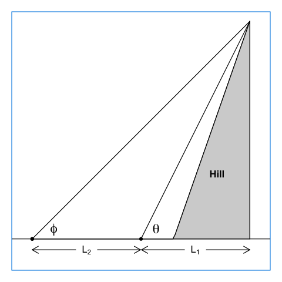

# Professional sextants

A sextant is an instrument for measuring angles between objects. They have been
used in navigation for centuries, because latitude can be inferred from a
measurement of the angle between the horizon and the noontime sun. For this
reason, professional sextants have a way of sighting the sun angle without
looking at the sun.  This method is **not** a possibility with the sextant
described below; rather the typical purpose is to infer the heights of
buildings, trees, or hills.

# A homemade sextant

A crude sextant can be created quite simply.  With it, one can find the heights
of objects, using a method invented a thousand years ago by Al Biruni (see
Peter Lynch's blog posting “Al Biruni and the Size of the Earth.” ThatsMaths,
June 10, 2021.
https://thatsmaths.com/2021/06/10/al-biruni-and-the-size-of-the-earth/). Not
only is a fun activity, but it's a good way to see that high-school
trigonometry is useful!

To make the sextant, follow these steps:

1. Print either the file named `sextant1.pdf` or the one named `sextant2.pdf` on
   a sheet of paper. (These files differ in how the angles are laid out. Pick
   whichever one you find easier to read.)
2. Paste it on a sheet of thick cardboard or thin wood.
3. If you wish, cut along the gray outer semicircle, to eliminate corners.
4. Create a pivot at the point marked "P". If the sextant is mounted
   on wood, a pivot can be made with half-hammered nail, or a thin dowel (perhaps
   a round toothpick) inserted into a pre-drilled hole. If it is mounted on
   a piece of corrugated cardboard, a round toothpick can inserted by hand.
   In either case, the pivot must be inserted at right angles to the plane of
   the sextant.  To keep it so aligned, try using some glue.
5. Attach fishing line, sewing thread, or thin string, at the "P" pivot. The
   line should be long enough to extend past the bottom of the sextant.
   Attach something relatively small but heavy at the free end, which
   will weigh the line down, making it run vertically along the sextant,
   pointing in the downward direction.
6. Insert a mail, dowel or toothpick at the spot marked "S" (the sighting
   spot).

# Using the sextant

Hold it vertically, with the plumb line extending down to the round scale. Then
position it so that you can sight an object of interest.  Rotate it in the
vertical plane until the "P" and "S" points are aligned with the object. You
might need to wait a second or two for the plumb bob to stop moving.  When it
does, press your finger on the line, below the scale.  Holding your finger
there, turn the sextant so that you can read off the angle at the spot where
the plumb line intersects the round scale.  This is the angle along the
sighting line, with respect to the horizontal plane.

## Example 1: tree height


As illustrated above, you can find the height $H$ of a tree on flat ground, by
pacing off a distance $L$ from it's trunk, and then finding the angle $\theta$
to the top. The height, in paces, is then given by $L\tan\theta$.  (To convert
to meters or some other unit, count off some paces on a sidewalk, asking a
friend to mark the start and end spots by scratching with chalk or a stone.
Then measure the distance with a ruler or other measuring device.)  If you
don't have a calculator handy, you may use the table in the Appendix to get the
$\tan\theta$, and then multiply by hand to a couple of digits.


## Example 2: hill height

In the case of a sloping hill, it is difficult to measure the horizontal
distance between the top of the hill and the observer.  Pacing a distance off
gives distance along the slope, which is not the same as distance in the
horizontal direction.  But we need the horizontal distance to use the formula
from Example 1.  What to do?

Trigonometry can come to the rescue, provided that there is a flat plain nearby.
Just measure the angles at two spots on that plain, along with the distance
between them.  (Pacing works in this case because the ground is level.)



Consider the figure above, in which the two angles are $\theta$ and $\phi$, the
first being the value observed nearer the hill.  The distance between the
observation spots is $L_2$.  This may be measured by pacing off distance along
the flat plain, as a horizontal distance was measured in Example 1.

In this case, then, the goal is to infer hill height $H$ from measurements of
$\Theta$, $\phi$, and $L_2$.

If we knew $L_1$, we could apply the method of Example 1 at both spots, giving
two estimates of height.  However, we cannot determine $L_1$ without without
tunneling through the hill, so we cannot use the formula for *either* spot.

Tunneling is hard work.  But trigonometry can save us that work!  Let's write
formulas for the height inferred from the two observations.  At the nearby spot
we have

\[
H = L_1\tan\Theta
\]

and at the farther-away spot we have

\[
H = (L_1\ +\ L_2)\tan\phi
\]

but these must yield the same $H$ value, so we can combine the two equations,
yielding

\[
L_1 \tan\theta  = (L_1\ +\ L_2)\tan\phi
\]

which can be rearranged to

\[
L_2 (\tan\theta\ -\ \tan\phi) = L_1\ \tan\phi
\]

and then to

\[
L_1 = L_2 \ (\tan\phi)\ /\ (\tan\theta\ -\ \tan\phi)
\]

at which point we have a formula for the unknown distance $L_1$.  (Wow, the
magic of mathematics!)

Now, we can use this result our original formula for height at the nearby
spot, to get

\[
H = L_2\ (\tan\theta\ \tan\phi)\ /\ (\tan\theta\ -\ \tan\phi)
\]
```{r echo=FALSE}
theta <- atan2(1, 1-0.5)
phi <- atan2(1, 1)
thetaDeg <- round(theta * 180/pi, 3)
phiDeg <- round(phi * 180/pi, 3)
L2 <- 50
H <- L2 * tan(theta)*tan(phi)/(tan(theta)-tan(phi))
stopifnot(abs(H == 100) < 1e-7)
```


As an example, consider the illustration above, in which $\theta=`r thetaDeg`$,
$\phi=`r phiDeg`$, and suppose that a distance $L_2=50$m has been inferred by
pacing off the distance between the two observation locations.  The formula
given above yields an inferred hill height of $H=`r H`$m.

# Appendix: trigonometry tables

```{r echo=FALSE}
library(knitr)
angle <- seq(0, 89, 1)
sine <- sin(angle*pi/180)
cosine <- cos(angle*pi/180)
tangent <- tan(angle*pi/180)
df <- data.frame(angle,sine, cosine, tangent)
kable(df, digits=5)
```
