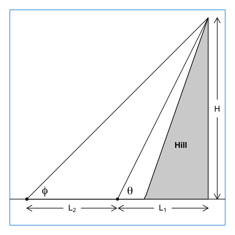

# Professional sextants

A sextant is an instrument for measuring angles between objects. They
have been used in navigation for centuries, because latitude can be
inferred from a measurement of the angle between the horizon and the
noontime sun. For this reason, professional sextants have a way of
sighting the sun angle without looking at the sun.

This sun-observation method is **certainly NOT** a possibility with the
sextant described below, because it lacks a sun-blocking mechanism, and
looking directly at the sun is **extremely** dangerous.

The purpose of the sextant provided here is to for use in finding angles
(with respect to the horizontal), which allows a person to infer the
heights of flagpoles, buildings, and even hills, by measuring a
horizontal distance and one or two angles.

# A homemade sextant

A crude sextant measuring angles with respect to the horizontal plane
can be used to determine the heights of objects, using a method invented
a thousand years ago by Al Biruni (see Peter Lynch’s blog posting “Al
Biruni and the Size of the Earth.” ThatsMaths, June 10, 2021.
<https://thatsmaths.com/2021/06/10/al-biruni-and-the-size-of-the-earth/>).
Carrying out such measurements and performing the associated
calculations can be a fun way to spend some time outside, and it’s also
a good way to see that high-school trigonometry can be useful!

To make the sextant, follow these steps:

1.  Print either the file named `sextant1.pdf` or the one named
    `sextant2.pdf` on a sheet of paper. (These files differ in how the
    angles are laid out. Pick whichever one you find easier to read.)
2.  Paste it on a sheet of thick cardboard or thin wood.
3.  If you wish, cut along the gray outer semicircle, to eliminate
    corners.
4.  Create a pivot at the point marked “P”. If the sextant is mounted on
    wood, a pivot can be made with half-hammered nail, or a thin dowel
    (perhaps a round toothpick) inserted into a pre-drilled hole. If it
    is mounted on a piece of corrugated cardboard, a round toothpick can
    inserted by hand. In either case, the pivot must be inserted at
    right angles to the plane of the sextant. To keep it so aligned, try
    using some glue.
5.  Attach fishing line, sewing thread, or thin string, at the “P”
    pivot. The line should be long enough to extend past the bottom of
    the sextant. Attach something relatively small but heavy at the free
    end, which will weigh the line down, making it run vertically along
    the sextant, pointing in the downward direction.
6.  Insert a mail, dowel or toothpick at the spot marked “S” (the
    sighting spot).

# Taking angle readings

Hold it vertically, with the plumb line extending down to the round
scale. Then position it so that you can sight an object of interest.
Rotate it in the vertical plane until the “P” and “S” points are aligned
with the object. You might need to wait a second or two for the plumb
bob to stop moving. When it does, press your finger on the line, below
the scale. Holding your finger there, turn the sextant so that you can
read off the angle at the spot where the plumb line intersects the round
scale. This is the angle along the sighting line, with respect to the
horizontal plane.

## Example 1: height of an object on a flat plain

As illustrated above, you can find the height *H* of a flagpole, tree,
building, etc., on flat ground, by pacing off[1] a horizontal distance
*L* from it’s base, and then finding the angle *θ* to the top. The
height above is then given by where *H**e* is the height of
your eye above the ground, which you may take to be your height.

If you don’t have a calculator handy, you may use the table in the
Appendix to get the tan *θ*, and carry out the calculation by hand to a
couple of digits. (As an exercise, repeat the pace-measure-calculate
exercise a few times, to get an idea of the uncertainty of the method.)

## Example 2: hill height

In the case of a sloping hill, it is difficult to measure the horizontal
distance between the top of the hill and the observer. Pacing a distance
off gives distance along the slope, which is not the same as distance in
the horizontal direction. But we need the horizontal distance to use the
formula from Example 1. What to do?

Trigonometry can come to the rescue, provided that there is a flat plain
nearby. Just measure the angles at two spots on that plain, along with
the distance between them. (Pacing works in this case because the ground
is level.)

Consider the figure above, in which the two angles are *θ* and *ϕ*, the
first being the value observed nearer the hill. The distance between the
observation spots is *L*2. This may be measured by pacing off
distance along the flat plain, as a horizontal distance was measured in
Example 1.

In this case, then, the goal is to infer hill height *H* from
measurements of *θ*, *ϕ*, and *L*2.

If we knew *L*1, we could apply the method of Example 1 at
both spots, giving two estimates of height. However, we cannot determine
*L*1 without without tunneling through the hill, so we cannot
use the formula for *either* spot.

Tunneling is hard work. But trigonometry can save us that work! Let’s
write formulas for the height inferred from the two observations. At the
nearby spot we have

*H* = *H**e* + *L*1tan *θ*

and at the farther-away spot we have

*H* = *H**e* + (*L*1 + *L*2)tan *ϕ*

but these must yield the same *H* value, so we can combine the two
equations, yielding

*L*1tan *θ* = (*L*1 + *L*2)tan *ϕ*

which can be rearranged to

*L*1(tan*θ* − tan*ϕ*) = *L*2 tan *ϕ*

and then to

*L*1 = *L*2 tan *ϕ* / (tan*θ* − tan*ϕ*)

at which point we have a formula for the unknown distance
*L*1, based on the easily-measured *θ*, *ϕ* and
*L*2. (Wow, the magic of mathematics!)

Now, we can use this result our original formula for height at the
nearby spot, to get

where, again, *H**e* is the height of you eye above the
ground.

As an example, print the illustration above and use a protractor to
measure angles and a ruler to measure *L*2. The protractor
should reveal that *θ* = 63∘ and *ϕ* = 45∘. The
formula then reveals that the ratio of *H* to *L*2 is 2. You
can check this with a ruler. As a further exercise, draw a diagram like
the one above, but with different angles, and see if the formula gives
the correct *H*, given your drawing. Indeed, a good way to understand
this might be to try a sequence of tests cases. You will see that
inferring *H* can be difficult, for certain angle ranges, and this is
something worth thinking about.

# Appendix: trigonometry tables

Note that sine and cosine are given here in addition to tangent. This is
because you might find them useful for related calculations.

<table>
<thead>
<tr class="header">
<th style="text-align: right;">angle</th>
<th style="text-align: right;">sine</th>
<th style="text-align: right;">cosine</th>
<th style="text-align: right;">tangent</th>
</tr>
</thead>
<tbody>
<tr class="odd">
<td style="text-align: right;">0</td>
<td style="text-align: right;">0.00000</td>
<td style="text-align: right;">1.00000</td>
<td style="text-align: right;">0.00000</td>
</tr>
<tr class="even">
<td style="text-align: right;">1</td>
<td style="text-align: right;">0.01745</td>
<td style="text-align: right;">0.99985</td>
<td style="text-align: right;">0.01746</td>
</tr>
<tr class="odd">
<td style="text-align: right;">2</td>
<td style="text-align: right;">0.03490</td>
<td style="text-align: right;">0.99939</td>
<td style="text-align: right;">0.03492</td>
</tr>
<tr class="even">
<td style="text-align: right;">3</td>
<td style="text-align: right;">0.05234</td>
<td style="text-align: right;">0.99863</td>
<td style="text-align: right;">0.05241</td>
</tr>
<tr class="odd">
<td style="text-align: right;">4</td>
<td style="text-align: right;">0.06976</td>
<td style="text-align: right;">0.99756</td>
<td style="text-align: right;">0.06993</td>
</tr>
<tr class="even">
<td style="text-align: right;">5</td>
<td style="text-align: right;">0.08716</td>
<td style="text-align: right;">0.99619</td>
<td style="text-align: right;">0.08749</td>
</tr>
<tr class="odd">
<td style="text-align: right;">6</td>
<td style="text-align: right;">0.10453</td>
<td style="text-align: right;">0.99452</td>
<td style="text-align: right;">0.10510</td>
</tr>
<tr class="even">
<td style="text-align: right;">7</td>
<td style="text-align: right;">0.12187</td>
<td style="text-align: right;">0.99255</td>
<td style="text-align: right;">0.12278</td>
</tr>
<tr class="odd">
<td style="text-align: right;">8</td>
<td style="text-align: right;">0.13917</td>
<td style="text-align: right;">0.99027</td>
<td style="text-align: right;">0.14054</td>
</tr>
<tr class="even">
<td style="text-align: right;">9</td>
<td style="text-align: right;">0.15643</td>
<td style="text-align: right;">0.98769</td>
<td style="text-align: right;">0.15838</td>
</tr>
<tr class="odd">
<td style="text-align: right;">10</td>
<td style="text-align: right;">0.17365</td>
<td style="text-align: right;">0.98481</td>
<td style="text-align: right;">0.17633</td>
</tr>
<tr class="even">
<td style="text-align: right;">11</td>
<td style="text-align: right;">0.19081</td>
<td style="text-align: right;">0.98163</td>
<td style="text-align: right;">0.19438</td>
</tr>
<tr class="odd">
<td style="text-align: right;">12</td>
<td style="text-align: right;">0.20791</td>
<td style="text-align: right;">0.97815</td>
<td style="text-align: right;">0.21256</td>
</tr>
<tr class="even">
<td style="text-align: right;">13</td>
<td style="text-align: right;">0.22495</td>
<td style="text-align: right;">0.97437</td>
<td style="text-align: right;">0.23087</td>
</tr>
<tr class="odd">
<td style="text-align: right;">14</td>
<td style="text-align: right;">0.24192</td>
<td style="text-align: right;">0.97030</td>
<td style="text-align: right;">0.24933</td>
</tr>
<tr class="even">
<td style="text-align: right;">15</td>
<td style="text-align: right;">0.25882</td>
<td style="text-align: right;">0.96593</td>
<td style="text-align: right;">0.26795</td>
</tr>
<tr class="odd">
<td style="text-align: right;">16</td>
<td style="text-align: right;">0.27564</td>
<td style="text-align: right;">0.96126</td>
<td style="text-align: right;">0.28675</td>
</tr>
<tr class="even">
<td style="text-align: right;">17</td>
<td style="text-align: right;">0.29237</td>
<td style="text-align: right;">0.95630</td>
<td style="text-align: right;">0.30573</td>
</tr>
<tr class="odd">
<td style="text-align: right;">18</td>
<td style="text-align: right;">0.30902</td>
<td style="text-align: right;">0.95106</td>
<td style="text-align: right;">0.32492</td>
</tr>
<tr class="even">
<td style="text-align: right;">19</td>
<td style="text-align: right;">0.32557</td>
<td style="text-align: right;">0.94552</td>
<td style="text-align: right;">0.34433</td>
</tr>
<tr class="odd">
<td style="text-align: right;">20</td>
<td style="text-align: right;">0.34202</td>
<td style="text-align: right;">0.93969</td>
<td style="text-align: right;">0.36397</td>
</tr>
<tr class="even">
<td style="text-align: right;">21</td>
<td style="text-align: right;">0.35837</td>
<td style="text-align: right;">0.93358</td>
<td style="text-align: right;">0.38386</td>
</tr>
<tr class="odd">
<td style="text-align: right;">22</td>
<td style="text-align: right;">0.37461</td>
<td style="text-align: right;">0.92718</td>
<td style="text-align: right;">0.40403</td>
</tr>
<tr class="even">
<td style="text-align: right;">23</td>
<td style="text-align: right;">0.39073</td>
<td style="text-align: right;">0.92050</td>
<td style="text-align: right;">0.42447</td>
</tr>
<tr class="odd">
<td style="text-align: right;">24</td>
<td style="text-align: right;">0.40674</td>
<td style="text-align: right;">0.91355</td>
<td style="text-align: right;">0.44523</td>
</tr>
<tr class="even">
<td style="text-align: right;">25</td>
<td style="text-align: right;">0.42262</td>
<td style="text-align: right;">0.90631</td>
<td style="text-align: right;">0.46631</td>
</tr>
<tr class="odd">
<td style="text-align: right;">26</td>
<td style="text-align: right;">0.43837</td>
<td style="text-align: right;">0.89879</td>
<td style="text-align: right;">0.48773</td>
</tr>
<tr class="even">
<td style="text-align: right;">27</td>
<td style="text-align: right;">0.45399</td>
<td style="text-align: right;">0.89101</td>
<td style="text-align: right;">0.50953</td>
</tr>
<tr class="odd">
<td style="text-align: right;">28</td>
<td style="text-align: right;">0.46947</td>
<td style="text-align: right;">0.88295</td>
<td style="text-align: right;">0.53171</td>
</tr>
<tr class="even">
<td style="text-align: right;">29</td>
<td style="text-align: right;">0.48481</td>
<td style="text-align: right;">0.87462</td>
<td style="text-align: right;">0.55431</td>
</tr>
<tr class="odd">
<td style="text-align: right;">30</td>
<td style="text-align: right;">0.50000</td>
<td style="text-align: right;">0.86603</td>
<td style="text-align: right;">0.57735</td>
</tr>
<tr class="even">
<td style="text-align: right;">31</td>
<td style="text-align: right;">0.51504</td>
<td style="text-align: right;">0.85717</td>
<td style="text-align: right;">0.60086</td>
</tr>
<tr class="odd">
<td style="text-align: right;">32</td>
<td style="text-align: right;">0.52992</td>
<td style="text-align: right;">0.84805</td>
<td style="text-align: right;">0.62487</td>
</tr>
<tr class="even">
<td style="text-align: right;">33</td>
<td style="text-align: right;">0.54464</td>
<td style="text-align: right;">0.83867</td>
<td style="text-align: right;">0.64941</td>
</tr>
<tr class="odd">
<td style="text-align: right;">34</td>
<td style="text-align: right;">0.55919</td>
<td style="text-align: right;">0.82904</td>
<td style="text-align: right;">0.67451</td>
</tr>
<tr class="even">
<td style="text-align: right;">35</td>
<td style="text-align: right;">0.57358</td>
<td style="text-align: right;">0.81915</td>
<td style="text-align: right;">0.70021</td>
</tr>
<tr class="odd">
<td style="text-align: right;">36</td>
<td style="text-align: right;">0.58779</td>
<td style="text-align: right;">0.80902</td>
<td style="text-align: right;">0.72654</td>
</tr>
<tr class="even">
<td style="text-align: right;">37</td>
<td style="text-align: right;">0.60182</td>
<td style="text-align: right;">0.79864</td>
<td style="text-align: right;">0.75355</td>
</tr>
<tr class="odd">
<td style="text-align: right;">38</td>
<td style="text-align: right;">0.61566</td>
<td style="text-align: right;">0.78801</td>
<td style="text-align: right;">0.78129</td>
</tr>
<tr class="even">
<td style="text-align: right;">39</td>
<td style="text-align: right;">0.62932</td>
<td style="text-align: right;">0.77715</td>
<td style="text-align: right;">0.80978</td>
</tr>
<tr class="odd">
<td style="text-align: right;">40</td>
<td style="text-align: right;">0.64279</td>
<td style="text-align: right;">0.76604</td>
<td style="text-align: right;">0.83910</td>
</tr>
<tr class="even">
<td style="text-align: right;">41</td>
<td style="text-align: right;">0.65606</td>
<td style="text-align: right;">0.75471</td>
<td style="text-align: right;">0.86929</td>
</tr>
<tr class="odd">
<td style="text-align: right;">42</td>
<td style="text-align: right;">0.66913</td>
<td style="text-align: right;">0.74314</td>
<td style="text-align: right;">0.90040</td>
</tr>
<tr class="even">
<td style="text-align: right;">43</td>
<td style="text-align: right;">0.68200</td>
<td style="text-align: right;">0.73135</td>
<td style="text-align: right;">0.93252</td>
</tr>
<tr class="odd">
<td style="text-align: right;">44</td>
<td style="text-align: right;">0.69466</td>
<td style="text-align: right;">0.71934</td>
<td style="text-align: right;">0.96569</td>
</tr>
<tr class="even">
<td style="text-align: right;">45</td>
<td style="text-align: right;">0.70711</td>
<td style="text-align: right;">0.70711</td>
<td style="text-align: right;">1.00000</td>
</tr>
<tr class="odd">
<td style="text-align: right;">46</td>
<td style="text-align: right;">0.71934</td>
<td style="text-align: right;">0.69466</td>
<td style="text-align: right;">1.03553</td>
</tr>
<tr class="even">
<td style="text-align: right;">47</td>
<td style="text-align: right;">0.73135</td>
<td style="text-align: right;">0.68200</td>
<td style="text-align: right;">1.07237</td>
</tr>
<tr class="odd">
<td style="text-align: right;">48</td>
<td style="text-align: right;">0.74314</td>
<td style="text-align: right;">0.66913</td>
<td style="text-align: right;">1.11061</td>
</tr>
<tr class="even">
<td style="text-align: right;">49</td>
<td style="text-align: right;">0.75471</td>
<td style="text-align: right;">0.65606</td>
<td style="text-align: right;">1.15037</td>
</tr>
<tr class="odd">
<td style="text-align: right;">50</td>
<td style="text-align: right;">0.76604</td>
<td style="text-align: right;">0.64279</td>
<td style="text-align: right;">1.19175</td>
</tr>
<tr class="even">
<td style="text-align: right;">51</td>
<td style="text-align: right;">0.77715</td>
<td style="text-align: right;">0.62932</td>
<td style="text-align: right;">1.23490</td>
</tr>
<tr class="odd">
<td style="text-align: right;">52</td>
<td style="text-align: right;">0.78801</td>
<td style="text-align: right;">0.61566</td>
<td style="text-align: right;">1.27994</td>
</tr>
<tr class="even">
<td style="text-align: right;">53</td>
<td style="text-align: right;">0.79864</td>
<td style="text-align: right;">0.60182</td>
<td style="text-align: right;">1.32704</td>
</tr>
<tr class="odd">
<td style="text-align: right;">54</td>
<td style="text-align: right;">0.80902</td>
<td style="text-align: right;">0.58779</td>
<td style="text-align: right;">1.37638</td>
</tr>
<tr class="even">
<td style="text-align: right;">55</td>
<td style="text-align: right;">0.81915</td>
<td style="text-align: right;">0.57358</td>
<td style="text-align: right;">1.42815</td>
</tr>
<tr class="odd">
<td style="text-align: right;">56</td>
<td style="text-align: right;">0.82904</td>
<td style="text-align: right;">0.55919</td>
<td style="text-align: right;">1.48256</td>
</tr>
<tr class="even">
<td style="text-align: right;">57</td>
<td style="text-align: right;">0.83867</td>
<td style="text-align: right;">0.54464</td>
<td style="text-align: right;">1.53986</td>
</tr>
<tr class="odd">
<td style="text-align: right;">58</td>
<td style="text-align: right;">0.84805</td>
<td style="text-align: right;">0.52992</td>
<td style="text-align: right;">1.60033</td>
</tr>
<tr class="even">
<td style="text-align: right;">59</td>
<td style="text-align: right;">0.85717</td>
<td style="text-align: right;">0.51504</td>
<td style="text-align: right;">1.66428</td>
</tr>
<tr class="odd">
<td style="text-align: right;">60</td>
<td style="text-align: right;">0.86603</td>
<td style="text-align: right;">0.50000</td>
<td style="text-align: right;">1.73205</td>
</tr>
<tr class="even">
<td style="text-align: right;">61</td>
<td style="text-align: right;">0.87462</td>
<td style="text-align: right;">0.48481</td>
<td style="text-align: right;">1.80405</td>
</tr>
<tr class="odd">
<td style="text-align: right;">62</td>
<td style="text-align: right;">0.88295</td>
<td style="text-align: right;">0.46947</td>
<td style="text-align: right;">1.88073</td>
</tr>
<tr class="even">
<td style="text-align: right;">63</td>
<td style="text-align: right;">0.89101</td>
<td style="text-align: right;">0.45399</td>
<td style="text-align: right;">1.96261</td>
</tr>
<tr class="odd">
<td style="text-align: right;">64</td>
<td style="text-align: right;">0.89879</td>
<td style="text-align: right;">0.43837</td>
<td style="text-align: right;">2.05030</td>
</tr>
<tr class="even">
<td style="text-align: right;">65</td>
<td style="text-align: right;">0.90631</td>
<td style="text-align: right;">0.42262</td>
<td style="text-align: right;">2.14451</td>
</tr>
<tr class="odd">
<td style="text-align: right;">66</td>
<td style="text-align: right;">0.91355</td>
<td style="text-align: right;">0.40674</td>
<td style="text-align: right;">2.24604</td>
</tr>
<tr class="even">
<td style="text-align: right;">67</td>
<td style="text-align: right;">0.92050</td>
<td style="text-align: right;">0.39073</td>
<td style="text-align: right;">2.35585</td>
</tr>
<tr class="odd">
<td style="text-align: right;">68</td>
<td style="text-align: right;">0.92718</td>
<td style="text-align: right;">0.37461</td>
<td style="text-align: right;">2.47509</td>
</tr>
<tr class="even">
<td style="text-align: right;">69</td>
<td style="text-align: right;">0.93358</td>
<td style="text-align: right;">0.35837</td>
<td style="text-align: right;">2.60509</td>
</tr>
<tr class="odd">
<td style="text-align: right;">70</td>
<td style="text-align: right;">0.93969</td>
<td style="text-align: right;">0.34202</td>
<td style="text-align: right;">2.74748</td>
</tr>
<tr class="even">
<td style="text-align: right;">71</td>
<td style="text-align: right;">0.94552</td>
<td style="text-align: right;">0.32557</td>
<td style="text-align: right;">2.90421</td>
</tr>
<tr class="odd">
<td style="text-align: right;">72</td>
<td style="text-align: right;">0.95106</td>
<td style="text-align: right;">0.30902</td>
<td style="text-align: right;">3.07768</td>
</tr>
<tr class="even">
<td style="text-align: right;">73</td>
<td style="text-align: right;">0.95630</td>
<td style="text-align: right;">0.29237</td>
<td style="text-align: right;">3.27085</td>
</tr>
<tr class="odd">
<td style="text-align: right;">74</td>
<td style="text-align: right;">0.96126</td>
<td style="text-align: right;">0.27564</td>
<td style="text-align: right;">3.48741</td>
</tr>
<tr class="even">
<td style="text-align: right;">75</td>
<td style="text-align: right;">0.96593</td>
<td style="text-align: right;">0.25882</td>
<td style="text-align: right;">3.73205</td>
</tr>
<tr class="odd">
<td style="text-align: right;">76</td>
<td style="text-align: right;">0.97030</td>
<td style="text-align: right;">0.24192</td>
<td style="text-align: right;">4.01078</td>
</tr>
<tr class="even">
<td style="text-align: right;">77</td>
<td style="text-align: right;">0.97437</td>
<td style="text-align: right;">0.22495</td>
<td style="text-align: right;">4.33148</td>
</tr>
<tr class="odd">
<td style="text-align: right;">78</td>
<td style="text-align: right;">0.97815</td>
<td style="text-align: right;">0.20791</td>
<td style="text-align: right;">4.70463</td>
</tr>
<tr class="even">
<td style="text-align: right;">79</td>
<td style="text-align: right;">0.98163</td>
<td style="text-align: right;">0.19081</td>
<td style="text-align: right;">5.14455</td>
</tr>
<tr class="odd">
<td style="text-align: right;">80</td>
<td style="text-align: right;">0.98481</td>
<td style="text-align: right;">0.17365</td>
<td style="text-align: right;">5.67128</td>
</tr>
<tr class="even">
<td style="text-align: right;">81</td>
<td style="text-align: right;">0.98769</td>
<td style="text-align: right;">0.15643</td>
<td style="text-align: right;">6.31375</td>
</tr>
<tr class="odd">
<td style="text-align: right;">82</td>
<td style="text-align: right;">0.99027</td>
<td style="text-align: right;">0.13917</td>
<td style="text-align: right;">7.11537</td>
</tr>
<tr class="even">
<td style="text-align: right;">83</td>
<td style="text-align: right;">0.99255</td>
<td style="text-align: right;">0.12187</td>
<td style="text-align: right;">8.14435</td>
</tr>
<tr class="odd">
<td style="text-align: right;">84</td>
<td style="text-align: right;">0.99452</td>
<td style="text-align: right;">0.10453</td>
<td style="text-align: right;">9.51436</td>
</tr>
<tr class="even">
<td style="text-align: right;">85</td>
<td style="text-align: right;">0.99619</td>
<td style="text-align: right;">0.08716</td>
<td style="text-align: right;">11.43005</td>
</tr>
<tr class="odd">
<td style="text-align: right;">86</td>
<td style="text-align: right;">0.99756</td>
<td style="text-align: right;">0.06976</td>
<td style="text-align: right;">14.30067</td>
</tr>
<tr class="even">
<td style="text-align: right;">87</td>
<td style="text-align: right;">0.99863</td>
<td style="text-align: right;">0.05234</td>
<td style="text-align: right;">19.08114</td>
</tr>
<tr class="odd">
<td style="text-align: right;">88</td>
<td style="text-align: right;">0.99939</td>
<td style="text-align: right;">0.03490</td>
<td style="text-align: right;">28.63625</td>
</tr>
<tr class="even">
<td style="text-align: right;">89</td>
<td style="text-align: right;">0.99985</td>
<td style="text-align: right;">0.01745</td>
<td style="text-align: right;">57.28996</td>
</tr>
</tbody>
</table>

[1] It’s easy to convert a paced-off distance to an actual distance by
pacing off 10 paving stones in a sidewalk and using a ruler to measure
the length of one of the stones.
